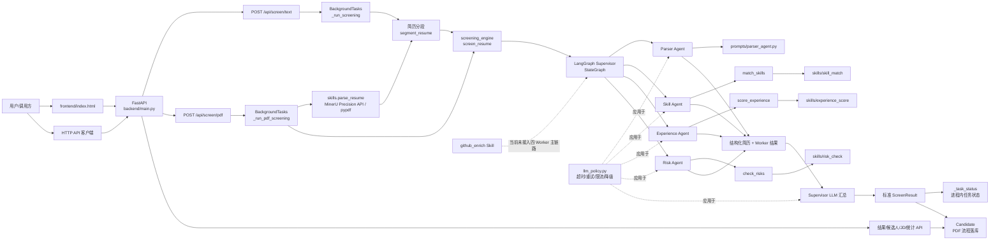
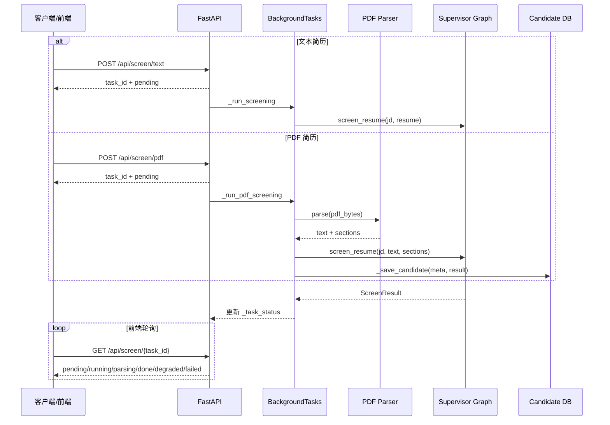
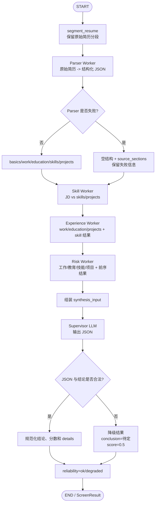
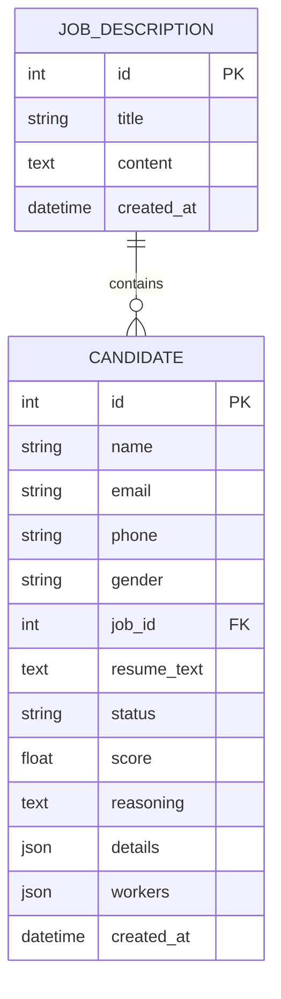
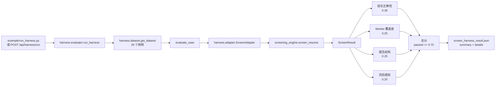
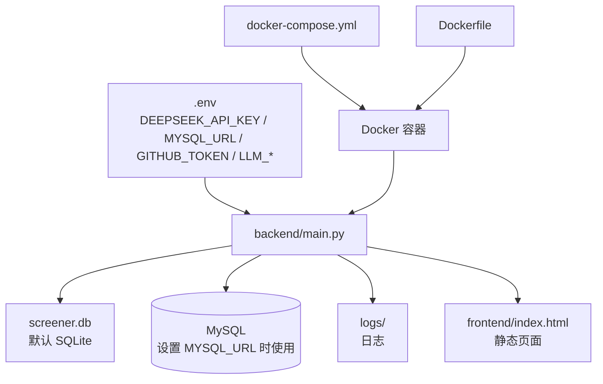

# resume-agent 项目结构与运行链路

> 本文基于当前工作区源码整理，目标是说明模块边界、主要调用关系、数据流和运行入口。图表均使用 Mermaid，可直接在支持 Mermaid 的 Markdown 阅读器中渲染。

## 1. 项目定位

`resume-agent` 是一个 FastAPI + LangGraph 的简历筛选系统：输入岗位描述（JD）和候选人简历文本或 PDF，系统先解析简历，再由四个 Worker Agent 按固定顺序完成技能、经历和风险分析，最后由 Supervisor LLM 汇总为标准化结论。

主要结论值为：

- `建议面试`
- `待定`
- `不匹配`

当 Worker 或 Supervisor 调用失败时，系统保留失败信息，并将可靠性标记为 `degraded`，结果默认倾向于 `待定`，交由人工复核。

## 2. 顶层目录

```text
resume-agent/
├── backend/                    # FastAPI 应用、HTTP API、后台任务和数据库模型
│   ├── main.py                 # 应用入口、路由、筛选任务、健康检查
│   └── models.py               # SQLAlchemy 模型和数据库初始化
├── screening_engine/           # 核心筛选编排层
│   ├── supervisor_graph.py     # LangGraph 图、四 Worker 顺序、Supervisor 汇总
│   ├── llm_policy.py           # LLM 创建、超时、重试、限流和降级策略
│   └── agents/                 # 四个 LangGraph ReAct Worker Agent
│       ├── parser_agent.py
│       ├── skill_agent.py
│       ├── experience_agent.py
│       └── risk_agent.py
├── prompts/                    # Agent 和 Skill 使用的系统提示词
│   ├── parser_agent.py
│   ├── skill_agent.py
│   ├── experience_agent.py
│   ├── risk_agent.py
│   ├── supervisor.py
│   └── experience_scorer.py
├── skills/                     # 可复用工具 Skill；部分通过 @tool 注册给 Worker
│   ├── parse_resume/            # PDF -> 文本/分段，MinerU 精准 API，pypdf 兜底
│   ├── skill_match/             # JD 与简历技能关键词匹配
│   ├── experience_score/        # LLM 评估项目/实习经历
│   ├── risk_check/              # 规则化风险信号检测
│   └── github_enrich/            # GitHub 用户和仓库信息增强
├── harness/                    # 自动化评测框架
│   ├── adapter.py               # 将 screen_resume 适配为 Harness 接口
│   ├── dataset.py               # 评测样例数据
│   └── evaluator.py             # 四维评分和汇总
├── frontend/                   # 单页前端
│   └── index.html               # 筛选、候选人、历史、Harness 页面
├── tests/                      # 项目自检测试
│   └── test_all.py
├── example/                    # Harness 和自定义 JD 的示例脚本
├── scripts/                    # 数据集生成、抽取、重建和最终评测脚本
├── real_data/                  # 真实/构造简历与最终分类样本
├── logs/                       # 运行日志目录
├── requirements.txt            # Python 依赖
├── Dockerfile                  # 容器镜像入口
├── docker-compose.yml          # Compose 启动配置
├── .env.example                # 环境变量模板
├── screener.db                 # 默认 SQLite 数据库（运行时数据）
├── README.md                   # 使用说明
└── HANDOVER_TODO.md            # 交接和待办事项
```

补充说明：`.codegraph/` 是代码索引目录；`__pycache__/` 是 Python 运行生成物，不属于业务源码。

## 3. 总体架构



## 4. 两条输入路径

### 4.1 文本简历

1. 客户端调用 `POST /api/screen/text`，提交 `jd_text` 和 `resume_text`。
2. FastAPI 生成 UUID 任务并写入进程内 `_task_status`，初始状态为 `pending`。
3. `BackgroundTasks` 执行 `_run_screening`，状态变为 `running`。
4. `screen_resume()` 先调用 `segment_resume()`，然后进入 Supervisor 图。
5. 结果写回 `_task_status`，状态为 `done` 或 `degraded`；异常时为 `failed`。
6. 客户端轮询 `GET /api/screen/{task_id}` 获取结果。

### 4.2 PDF 简历

1. 客户端调用 `POST /api/screen/pdf`，以 multipart 形式提交 PDF、JD 及可选候选人元数据。
2. 后台任务 `_run_pdf_screening` 先将任务状态设为 `parsing`。
3. `skills.parse_resume.parser.ResumeParser` 调用 MinerU 精准 API 的 `/api/v4/file-urls/batch` 申请上传地址。
4. 客户端通过签名 URL `PUT` 上传 PDF，随后轮询 `/api/v4/extract-results/batch/{batch_id}`。
5. 解析完成后下载结果 ZIP 中的 `full.md`；API 失败时可由 `MINERU_FALLBACK_TO_PYPDF=true` 启用 `pypdf` 兜底。
6. 解析结果包含文本、分段、来源和长度；解析失败直接返回 `failed`。
7. 文本进入与文本简历相同的 `screen_resume()` Supervisor 流程，并将候选人结果写入 SQLite/MySQL 的 `Candidate` 表。



## 5. Supervisor / Worker 流程

Supervisor 图在 `create_screen_graph()` 中只有一个业务节点：`supervisor_react_node`。图结构是 `START -> supervisor -> END`，四个 Worker 在该节点内部按固定顺序串行执行。



### Worker 与 Skill 映射

| Worker | Agent 文件 | Prompt | 注册的工具 | 主要输出 |
|---|---|---|---|---|
| Parser | `screening_engine/agents/parser_agent.py` | `prompts/parser_agent.py` | 无 | 结构化简历 JSON |
| Skill | `screening_engine/agents/skill_agent.py` | `prompts/skill_agent.py` | `match_skills` | 匹配/缺失技能、匹配率 |
| Experience | `screening_engine/agents/experience_agent.py` | `prompts/experience_agent.py` | `score_experience` | 项目/实习评分、优缺点 |
| Risk | `screening_engine/agents/risk_agent.py` | `prompts/risk_agent.py` | `check_risks` | 风险 flags、数量、等级 |

`github_enrich` 提供 `enrich_github` 工具，可以从简历中提取 GitHub 用户名并访问 GitHub API，但当前没有在四个 Worker 的 `create_react_agent(..., tools=[...])` 中注册，因此不属于当前默认筛选链路。

## 6. 结果结构与可靠性

核心结果类型由 `ScreenResult` 约束，主要字段如下：

```text
{
  "conclusion": "建议面试 | 待定 | 不匹配",
  "reasoning": "Supervisor 的综合理由",
  "score": 0.0 ~ 1.0,
  "details": {
    "parser": {...},
    "skill": {...},
    "experience": {...},
    "risk": {...},
    "supervisor": {"raw": "...", "summary": {...}},
    "reliability": {
      "status": "ok | degraded",
      "failed_workers": [...],
      "supervisor_error": "...",
      "policy": {...}
    }
  },
  "activated_workers": ["parser", "skill", "experience", "risk"]
}
```

规范化规则：

- `pass` 会映射为 `建议面试`，`pending` 映射为 `待定`，`reject` 映射为 `不匹配`。
- 结论不在允许集合时回退为 `待定`。
- Worker 发生 `error`、`failed`、`timeout` 或 `rate_limited` 时，最终结论强制降级为 `待定`。
- Supervisor 返回无法解析的 JSON 或调用异常时，保留 Worker 结果并生成 fallback 结果。

## 7. 数据库模型

默认使用项目根目录的 `screener.db` SQLite；设置 `MYSQL_URL` 后可切换到 MySQL。`backend/models.py` 导入时会执行 `init_db()`，通过 `Base.metadata.create_all()` 创建表。



当前落库边界：PDF 筛选流程会调用 `_save_candidate()`；文本筛选流程只写入进程内 `_task_status`，不会自动创建 `Candidate` 记录。

## 8. HTTP API

| 方法 | 路径 | 作用 |
|---|---|---|
| `GET` | `/` | 返回 `frontend/index.html` |
| `GET` | `/health` | 检查 LLM Key、数据库和 PDF 解析提供者，返回 `ok` 或 `degraded` |
| `POST` | `/api/jd` | 创建岗位描述 |
| `GET` | `/api/jd` | 按创建时间倒序读取岗位描述 |
| `POST` | `/api/screen/text` | 提交文本简历，异步筛选 |
| `POST` | `/api/screen/pdf` | 提交 PDF 简历，异步解析并筛选 |
| `GET` | `/api/screen/{task_id}` | 查询任务状态或已落库候选人结果 |
| `GET` | `/api/candidates` | 分页读取候选人，可按 `job_id`、`status` 过滤 |
| `PUT` | `/api/candidates/{candidate_id}/status` | 人工修改候选人状态 |
| `GET` | `/api/stats` | 读取候选人总数及三类结论统计 |
| `POST` | `/api/harness/run` | 运行自动化 Harness 评测 |

### 已知接口不一致

前端 `frontend/index.html` 的历史页会请求 `GET /api/history?page=1&limit=50`，但当前 `backend/main.py` 没有对应路由。因此历史 Tab 的请求在当前代码下无法形成完整闭环；任务查询仍可通过 `GET /api/screen/{task_id}` 完成。

## 9. Harness 评测链路



评测过程按用例串行执行，每份简历之间默认等待 3 秒以降低 API 限流风险。`tests/test_all.py` 会使用 MockAdapter 测试评分逻辑，因此不需要实际调用 LLM。

## 10. 配置与部署



常用入口：

```bash
python backend/main.py
docker compose up --build
python tests/test_all.py
python example/run_harness.py
```

关键运行依赖包括 LangGraph/LangChain、FastAPI、`python-multipart`、`pypdf`、SQLAlchemy、PyMySQL 和 Uvicorn。LLM 调用策略通过 `.env` 中的超时、重试、退避和限流参数控制。

## 11. 测试与维护关注点

- `tests/test_all.py` 覆盖 Skill 基础行为、PDF 分段保留、Agent 导入、Supervisor 图创建、Harness 评分和后端路由加载。
- Agent 采用懒加载；导入模块不等于真正发起 LLM 请求。
- `_task_status` 是进程内字典，服务重启后任务状态丢失；长期任务历史依赖数据库时需要补充统一的任务表或历史 API。
- `/api/history` 当前只有前端调用，没有后端实现，应在后续维护中补齐或修改前端调用。
- `github_enrich` 当前是独立 Skill，若要进入主链路，需要明确注册到某个 Worker、处理网络失败和纳入可靠性结果。
- 生产部署前应检查 `DEEPSEEK_API_KEY`、数据库连接、PDF provider 和 CORS 配置；`/health` 会把缺少关键能力的状态标记为 `degraded`。
